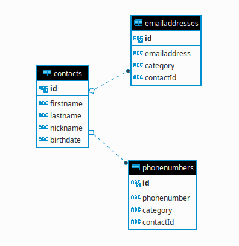

# Contacts API Dokumentation

## Frontend

Das Frontend ist im wesentlichen aufgeteilt in einen statischen und dynamischen Teil.

### Statischer Teil (index.html & CSS)

Der statische Teil besteht aus der Datei [index.html](../src/api/public/index.html). Diese lädt weitere statische Inhalte (sog. Assets) wie z.B. CSS und JavaScript Bibliotheken.

Das HTML selber weißt dabei aber keinerlei Interaktivität auf.

### Dynamischer Teil (client.js)

Der dynamische Teil des Frontends ist komplett in der Datei [client.js](../src/api/public/client.js) umgesetzt.

Dabei findet sich am Anfang der Datei der sog. "on document ready"-handler. Dieser sorgt dafür, dass die `init`-Funktion aufgerufen wird, sobald der Browser das HTML-Dokument sowie alle Abhängigkeiten geladen hat.

Die  `init`-Funktion ist dann dafür zuständig die interaktiven Elemente der statischen `index.html` mit "Leben" zu versehen.

Anschließend wird dann mithilfe der `fetch` Browser API die Kontaktliste vom Backend geladen und dynamisch an das DOM angefügt und angezeigt (hier spricht man von "rendern").

Im dynamischen Teil der Frontend-Anwendung wird stark auf asynchrone Programmierung mithilfe von `async` und `await` gesetzt. Dadurch bleibt der geschriebene Code eher "linear" anstatt in immer tiefer verschachtelte Callbacks abzusteigen.

An anderen Stellen (insbesondere bei der Verarbeitung von HTML Events wie z.B. Mausklicks) werden klassische Callbacks verwendet, die aufgerufen werden, sobald der entsprechende Event eintritt.

## Backend

### Datenbankschema

Die Datenbank zum speichern der Kontakte und der dazugehörigen Emailaddressen und Telefonnummern ist recht simpel mit drei Tabellen aufgebaut.

### REST API

Die REST API spiegelt im wesentlichen die im Datenbankschema definierten Entitäten als Endpunkte wieder:

* `/api/v1/contacts`
* `/api/v1/phonenumbers`
* `/api/v1/emailaddresses`

Die Implementierung dieser Endpunkte findet jeweils in einer eigenen Datei im Ordner [./src/api/routes/api/](../src/api/routes/api/) statt.